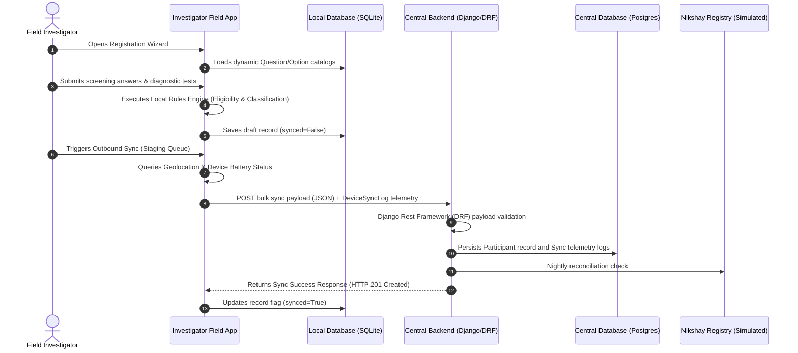

# Role-Based Access Control (RBAC) & System Design Documentation

This document provides a detailed catalog of available navigation items, page actions, filters, business logic algorithms, and security constraints applied to each role/login session in the **aBCG Monitoring & Tuberculosis Surveillance Dashboard**, followed by the application's core System Design architecture.

---

## 1. System Roles Directory
The application manages access control through the Django authentication system. A custom user profile (`UserProfile`) links each authenticated user to one of five designated system roles:

| Role Name (Code) | Target User Category | Scoping & Jurisdictional Access | Description / Primary Action Area |
| :--- | :--- | :--- | :--- |
| **`Super Admin`** | National Administrator | Global (unrestricted) | Full platform configuration, role permission matrix overrides, and campaign settings. |
| **`Admin`** | District/State Administrator | State & District Scoped | Regional operations, user account management, and aggregate report access. |
| **`Nodal Officer`** | Regional Monitoring Coordinator | State & District Scoped | Nodal operations monitoring, telemetry reviews, and regional data quality auditing. |
| **`Doctor`** | Clinical Reviewer / Adjudicator | State, District, & TB Unit Scoped | Clinical verification, diagnostic resolution queue, and Case overrides. |
| **`Field Investigator`** | Field Data Collector | State, District, & TB Unit Scoped | Offline/online participant screening, registration wizard, and local tablet sync. |
| **`System`** *(Service)* | Automated Rule Engine | System (Background context) | Automated screening engine, classification verdicts, and exception triggers. |

---

## 2. Detailed Permissions by User Role

### 2.1 Role: Super Admin (National Administrator)
* **Access Level**: Absolute, bypassing all permission checks.
* **Workspace Sidebar**: View all 13 sidebar modules.
* **Geographical Scope**: Global. Can view and modify records for all states, districts, and TB units globally.
* **Action Permissions**:
  * **Role/Permission Matrix Admin**: Exclusive permission to read and write to the dynamic permission matrix (`rbac_roles` view).
  * **Group Administration**: Exclusive access to the group membership management interface (`rbac_groups`).
  * **User Management**: Read and write access to create, modify, and delete user profiles and roles (`rbac_users`).
  * **Global Settings Admin**: Complete authorization to adjust campaign sites launch dates, conclusion dates, and washout gate thresholds.
  * **Data Export**: Full permission to request and download national raw cohorts in `.xlsx`, `.csv`, or `.json` formats.
  * **Clinical Case Override**: Permitted to override clinical status and classification verdicts at any time.

### 2.2 Role: Admin (District/State Administrator)
* **Access Level**: Regulated by the active permission matrix, scoped jurisdictionally.
* **Workspace Sidebar**: View all 13 sidebar modules (excluding groups management).
* **Geographical Scope**: State and District. Queries are constrained to:
  `WHERE state == user.profile.state AND district == user.profile.district`
* **Action Permissions**:
  * **User Management**: Allowed to create and update local user profiles (`rbac_users` view).
  * **Participant Registration**: Default allowed to View, Create, Edit, and Export local registrations.
  * **Nikshay Reconciliation**: Default allowed to View, Create, Edit, Reconcile, and Export comparisons.
  * **Bulk Sync & Staging**: Default allowed to View, Edit, and Approve local data synchronizations.
  * **Global Settings**: Allowed to view and edit settings parameters for local campaign sites.
  * **Audit & Telemetry Logs**: Allowed to view and export sync histories and logs.

### 2.3 Role: Nodal Officer (Regional Monitoring Coordinator)
* **Access Level**: Regulated by the active permission matrix, scoped jurisdictionally.
* **Workspace Sidebar**: View all 13 sidebar modules (excluding user and groups management).
* **Geographical Scope**: State and District. Queries are constrained to:
  `WHERE state == user.profile.state AND district == user.profile.district`
* **Action Permissions**:
  * **Participant Registration**: Restricted to View and Export operations only. Cannot create or edit registration forms.
  * **Diagnostic Review**: Restricted to View and Export operations.
  * **Nikshay Reconciliation**: Allowed to View, Reconcile, and Export comparison metrics.
  * **Bulk Sync**: Allowed to View and Reconcile inbound payloads.
  * **Global Settings**: Read-only access to campaign site gates.
  * **Telemetry & Logs**: View-only access to sync logs and device status.

### 2.4 Role: Doctor (Clinical Reviewer / Adjudicator)
* **Access Level**: Clinical workspace focused.
* **Workspace Sidebar**: View all 13 sidebar modules.
* **Geographical Scope**: TB Unit. Queries are constrained to:
  `WHERE state == user.profile.state AND district == user.profile.district AND tb_unit == user.profile.tb_unit`
* **Action Permissions**:
  * **Clinical Queue**: Primary actor on the Doctor's diagnostic review queue (`doctor_queue` and `doctor_verify`).
  * **Participant Registration**: View-only access to profiles. Cannot create or edit registration forms.
  * **Diagnostic Review**: Allowed to Create, Edit, and Reconcile diagnosis fields.
  * **Nikshay Reconciliation**: View-only access.
  * **Admin/Sync/Telemetry/Settings**: Blocked. Cannot access sync dashboards, audit logs, or settings fields.

### 2.5 Role: Field Investigator (Field Data Collector)
* **Access Level**: Restricted to data collection interface.
* **Workspace Sidebar**: Blocked (hidden). Renders a minimal home page with 4 options.
* **Geographical Scope**: TB Unit. Dashboard statistics are further constrained to only display records created by the active user:
  `WHERE state == user.profile.state AND district == user.profile.district AND tb_unit == user.profile.tb_unit AND created_by == active_user`
* **Action Permissions**:
  * **Participant Registration**: Allowed to View, Create, and Edit registrations.
  * **Nikshay Reconciliation**: Allowed to View and Reconcile/Approve comparison logs.
  * **Bulk Sync & Telemetry**: Allowed to View and Sync staging records.
  * **Admin & Dashboard Portal**: Blocked. Cannot access any dashboard views, audit logs, settings, or analytics.

### 2.6 Role: System (Automated Rule Engine & Services)
* **Access Level**: Background context execution.
* **Workspace Sidebar**: None.
* **Action Permissions**:
  * **Eligibility Engine**: Computes eligibility flags and maps priority tracks on participant save events.
  * **Classification Logic**: Assigns status verdicts (Case, Control, Pending, Excluded, Not Eligible, TPT+BCG) during registration.
  * **DQ Scans**: Automatically evaluates validation checks and raises exceptions (e.g. `MISSING_NAAT_RESULT`).
  * **Audit Log Generation**: Automated recording of execution events under username `system.rule-engine`.

---

## 3. Dynamic Permission Matrix (Module & Action Granularity)
The database model `RolePermission` governs real-time permission toggles. If the configuration is empty, the application falls back to `DEFAULT_PERMISSIONS` static thresholds:

| Module / Action Checked | Allowed Role Actions (Default Configuration) | Enforcing Views / Handlers |
| :--- | :--- | :--- |
| **`Participant Registration`** | <ul><li>**Admin**: View, Create, Edit, Export</li><li>**Nodal Officer**: View, Export</li><li>**Doctor**: View</li><li>**Field Investigator**: View, Create, Edit</li></ul> | `registration` (requires **Create** for new entry or **Edit** for updating a draft record) |
| **`Diagnostic Review (Doctor)`** | <ul><li>**Admin**: View, Export</li><li>**Nodal Officer**: View, Export</li><li>**Doctor**: View, Create, Edit, Approve/Reconcile</li><li>**Field Investigator**: *None*</li></ul> | `doctor_queue`, `doctor_verify` (clinical validation gates) |
| **`Nikshay Reconciliation`** | <ul><li>**Admin**: View, Create, Edit, Approve/Reconcile, Export</li><li>**Nodal Officer**: View, Create, Edit, Approve/Reconcile, Export</li><li>**Doctor**: View</li><li>**Field Investigator**: View, Approve/Reconcile</li></ul> | `reconcile` (compares local tablet records against Central Nikshay registry) |
| **`Bulk Sync Operations`** | <ul><li>**Admin**: View, Create, Edit, Approve/Reconcile, Export</li><li>**Nodal Officer**: View, Create, Edit, Approve/Reconcile, Export</li><li>**Doctor**: *None*</li><li>**Field Investigator**: View, Create, Edit, Approve/Reconcile</li></ul> | `pending_sync` (stage, queue, and upload offline drafts to Central server) |
| **`Global Settings Admin`** | <ul><li>**Admin**: View, Create, Edit, Approve/Reconcile, Export</li><li>**Nodal Officer**: View</li><li>**Doctor / Field Investigator**: *None*</ul> | `settings_view` (campaign timeline rules, launch, and conclude dates) |
| **`Telemetry & Audit Logs`** | <ul><li>**Admin**: View, Export</li><li>**Nodal Officer**: View, Export</li><li>**Doctor / Field Investigator**: *None*</ul> | `rbac_audit_logs`, `sync_telemetry_view` (audits logs and device telemetry) |

---

## 4. Eligibility & Priority Track Precedence (HRG)

### 4.1 Eligibility Criteria
A participant is marked overall `eligible` if they satisfy both high-risk eligibility and active campaign gates:
$$\text{eligible} = \text{has\_hrg} \land \text{eligible\_bcg\_campaign}$$
* **`has_hrg`**: Evaluates whether the participant falls into at least one of the six priority high-risk groups (below).
* **`eligible_bcg_campaign`**: Evaluates whether the participant is eligible for adult BCG vaccination during the designated campaign period, requiring at least one checked criteria tag.

### 4.2 Priority Track Assignment (Precedence Sequence)
When a participant meets multiple HRG criteria, the matching engine maps the candidate to a single primary track based on the following clinical precedence:

1. **Past History of TB** (`is_past_tb` / `"Past TB"`): Reported ATT treatment episode or history.
2. **Household Contact** (`is_contact` / `"Close Contact"`): Shared residence with active TB patient since 2021.
3. **Diabetes Mellitus** (`is_diabetes` / `"Diabetes"`): Self-reported diabetic.
4. **Low BMI / Undernourished** (`is_malnourished` / `"Malnourished (BMI < 18)"`): Computed $\text{BMI} < 18\text{ kg/m}^2$.
5. **Elderly** (`is_elderly` / `"Elderly (Age >= 60)"`): Candidate age is 60 years or older.
6. **Smoker / Tobacco History** (`is_smoker` / `"History of smoking tobacco"`): Self-reported active/past tobacco user.

---

## 5. Diagnostic Labeling & Classification Engine
During registration, the rules engine parses clinical test findings to assign a final `classification` and `classification_reason`:

```mermaid
graph TD
    A[Start: Evaluate Clinical Inputs] --> B{eligible == False?}
    B -- Yes --> C[Set classification = "Not Eligible"]
    B -- No --> D{bcg_complete == False?}
    D -- Yes --> E[Set classification = "Pending" <br> Reason: Incomplete BCG details]
    D -- No --> F{is_tpt_bcg == True?}
    F -- Yes --> G[Set classification = "TPT+BCG" <br> Reason: Eligible for BCG + TPT Cohort]
    F -- No --> H{CXR == ABNORMAL_NON_TB <br> and NAAT == NEGATIVE?}
    H -- Yes --> I[Set classification = "Excluded" <br> Reason: Abnormal non-TB CXR + NAAT Neg]
    H -- No --> J{Record created > 30 days ago <br> and any test PENDING?}
    J -- Yes --> K[Set classification = "Excluded" <br> Reason: Pending investigation > 1 month]
    J -- No --> L{NAAT == POSITIVE or CXR == <br> SUGGESTIVE_OF_TB or EPTB == POSITIVE?}
    L -- Yes --> M[Set classification = "Case"]
    L -- No --> N{CXR == NORMAL and NAAT == NEGATIVE <br> and EPTB == NEGATIVE?}
    N -- Yes --> O[Set classification = "Control"]
    N -- No --> P[Set classification = "Pending" <br> Reason: Awaiting investigation results]
```

### 5.1 Classification Criteria & Rule Matrix

* **`Not Eligible`**:
  * *Rule*: Participant fails the primary eligibility check (`eligible == False`).
* **`Pending`**:
  * *Rule*: BCG verification details are incomplete, or required lab/radiological tests are still marked `"PENDING"`.
* **`TPT+BCG`**:
  * *Rule*: `has_hrg` is True, `eligible_bcg_campaign` is True, `tpt_undergone` is `"Yes"`, and `bcg_status` starts with `"Yes"` (with complete verification date, batch, and facility).
* **`Excluded`**:
  * *Rule 1*: CXR is `"ABNORMAL_NON_TB"` and NAAT (`mctb`) is `"NEGATIVE"`.
  * *Rule 2*: Record has been open for $> 30$ days and any diagnostic test result is still `"PENDING"`.
* **`Case`**:
  * *Rule*: NAAT (`mctb`) is `"POSITIVE"` OR CXR is `"SUGGESTIVE_OF_TB"` OR `eptb_status` is `"POSITIVE"`.
* **`Control`**:
  * *Rule*: CXR is `"NORMAL"`, NAAT (`mctb`) is `"NEGATIVE"`, and EPTB symptoms are `"NO"` (or EPTB symptoms are `"YES"` and EPTB status is `"NEGATIVE"`).

### 5.2 BCG Verification Complete Condition
If `bcg_status` starts with `"Yes"`, all of the following validation checks must pass to mark the vaccination details complete:
1. `bcg_vaccination_date` (or raw date string) must be entered.
2. `bcg_batch_number` must be recorded.
3. `bcg_facility` must be recorded.

---

## 6. Data Quality (DQ) Exception Scanning
The automated scanning engine identifies data quality issues and flags records under specific rule types:

* **`MISSING_NAAT_RESULT`** (Critical): Case registered but NAAT (`mctb`) result field remains blank or empty.
* **`ENROL_BEFORE_WASHOUT`** (High): Participant registration date falls outside site-specific campaign windows or washout limits.
* **`INVALID_MOBILE_FORMAT`** (Medium): Registered primary mobile number does not match a 10-digit format.
* **`HRG_FLAG_CONFLICT`** (High): Risk flag `HRG_DM` is set to True but corroborating blood glucose levels are missing.
* **`DUPLICATE_NIKSHAY_ID`** (Critical): Nikshay ID matches an existing record.
* **`CXR_IMAGE_MISSING`** (High): Chest X-Ray is interpreted as `"Abnormal"` but no image file has been uploaded.

---

## 7. Clinical Adjudication Queue
Adjudication requests are raised to clinical reviewers when contradictions arise between different testing paths:

1. **NAAT vs CXR Mismatch**: NAAT is Positive but Chest X-Ray interpretation is Normal.
2. **Unverified EPTB Track**: Extrapulmonary checks indicate positive clinical diagnosis on multiple anatomical tracks, but no fluid chemistry/biopsy results have been uploaded.
3. **ATT Control Conflict**: A Control candidate has a recorded history of anti-tuberculosis therapy (`is_past_tb`), violating baseline eligibility requirements.
4. **Smear vs Culture Discordance**: Sputum smear is positive but sputum culture reports no growth.
5. **Physician vs Engine Discrepancy**: The automated rules engine evaluates classification as Non-TB, but the registering physician records a diagnosis of active TB.

---

## 8. System Design & Data Flow Architecture

The application is engineered as a distributed, offline-first client-server system consisting of the local **Investigator Field App** (running locally on tablets or laptops) and the **Central Sync Backend Server**.

### 8.1 System Components Interaction Diagram



---

### 8.2 Resilient Architecture Design Patterns

To remain resilient against frequent requests for changes to questionnaires, cutoffs, and thresholds by clinical stakeholders, the codebase implements three key architectural design patterns:

#### A. Dynamic Metadata Cataloging (Zero-Code Questionnaire Changes)
Rather than hardcoding survey fields directly as SQL schema columns, the app uses catalog models:
* Database tables `Question` and `Option` store dynamic questionnaire structures.
* The Participant model stores all survey answers as a single serialized JSON text field (`questionnaire_answers`).
* **Stakeholder Impact**: Adding, changing, or removing a question is done instantly by creating/editing records in the Django Admin portal. No database migrations, code revisions, or redeployments are required.

#### B. Decoupled Rules Engine (Zero-Code Eligibility Cutoffs)
Eligibility rules and diagnostic classification checks are isolated from the HTTP view endpoints:
* Clinical parameters (such as the BMI cutoff of `< 18` or age cutoff of `>= 60`) are stored on the central server inside a database-backed `GlobalSettings` model.
* The `RulesEngine` class dynamically fetches these settings values to evaluate records.
* **Stakeholder Impact**: Modifying age bounds, BMI bounds, or site campaign launch/conclusion gates is done instantly by updating the settings records via Django Admin.

#### C. Decoupled DRF Serialization
All API communication is processed via **Django REST Framework (DRF)**:
* DRF serializers validate the structure and datatype of sync payloads on ingress.
* Prevents corrupted or malformed payloads from offline clients from polluting the central database.

#### D. User Group Synchronization Database Signal
To maintain strict Django group-level view security, a database `post_save` signal on the `UserProfile` automatically manages Group assignments:
* Modifying a user's role choice immediately synchronizes native Django User Group membership.
* If a user's role is set to `"Super Admin"`, the signal automatically flags `is_superuser` and `is_staff` as `True` to grant database admin dashboard clearance.
